<!-- Banner gerado via capsule-render. Uma Action (random-banner.yml) sorteia
     uma combinacao de estilo/cor a cada 12h de uma lista curada e reescreve
     a linha abaixo direto no README, mesmo padrao usado no fun corner. -->
<!--START_SECTION:banner-->

<!--END_SECTION:banner-->

  <picture>
    <source media="(prefers-color-scheme: dark)" srcset="https://readme-typing-svg.demolab.com?font=Fira+Code&weight=500&size=22&duration=3000&pause=800&color=818CF8&center=true&vCenter=true&width=560&lines=Construo+ferramentas+para+problemas+reais;I+build+tools+for+real+problems;Ci%C3%AAncia+da+Computa%C3%A7%C3%A3o+no+UniCEUB;Computer+Science+at+UniCEUB;Em+breve%3A+dev+mobile+Flutter+na+%C3%ADlia;Soon%3A+Flutter+mobile+dev+at+%C3%ADlia">
    
  </picture>

  Estudante de Ciência da Computação (UniCEUB) · Desenvolvedor de Software · Brasília, DF 
  <em>Computer Science student (UniCEUB) · Software Developer · Brasília, Brazil</em>

  
  
  

  <a href="#sobre-mim">Sobre / About</a> ·
  <a href="#roadmap">Roadmap</a> ·
  <a href="#projetos">Projetos / Projects</a> ·
  <a href="#tech-stack">Stack</a> ·
  <a href="#certificados">Certificados / Certificates</a> ·
  <a href="#stats">Stats</a> ·
  <a href="#fun-corner">Fun corner</a> ·
  <a href="#contato">Contato / Contact</a>

---

### Sobre mim · About me

Estudante de Ciência da Computação no **UniCEUB**, em Brasília, com formatura prevista para dez/2028.\
Na **GONAR Engenharia Civil** sou assistente administrativo e crio as ferramentas de software que resolvem problemas reais da empresa, como o **RanchoControl**.\
Gosto de construir a aplicação inteira, do banco de dados à interface, com testes e deploy.\
Português nativo · inglês avançado (Casa Thomas Jefferson).

<em>Computer Science student at <b>UniCEUB</b> in Brasília, Brazil, graduating in Dec 2028. 
At <b>GONAR Engenharia Civil</b> I'm an administrative assistant and I build the software tools that solve the company's real problems, like <b>RanchoControl</b>. 
I like building the whole application, from the database to the interface, with tests and deploy. 
Native Portuguese · advanced English (Casa Thomas Jefferson).</em>

---

### Agora · Now

- 📱 A partir de **26/10/2026**: desenvolvedor mobile (Flutter/Dart) na **ília** 
  <em>Starting <b>Oct 26, 2026</b>: mobile developer (Flutter/Dart) at <b>ília</b></em>
- 🛠️ Mantendo o **RanchoControl** em uso real na GONAR 
  <em>Keeping <b>RanchoControl</b> in real use at GONAR</em>
- 🎮 Construindo o **[PlayHub](https://isaacgomes260653.github.io/CEUB_CIENCIA_2026/)**, um portal de mini-jogos para a Mostra de Ciências CEUB 2026, que já dá pra jogar 
  <em>Building <b>PlayHub</b>, a mini-games portal for the CEUB 2026 Science Fair, already playable</em>

### 🗺️ Roadmap de estudos · Study roadmap

<!-- ESTUDOS:INICIO -->
<!-- Gerado a partir do estudos.yml pelo workflow painel-estudos.yml. Não edite aqui: edite o estudos.yml. -->

🟢 Estudando / Studying · ⚪ A começar / Up next · ⏸️ Pausado / Paused · ✅ Concluído / Done

#### Rumo ao Flutter — preparação para o novo emprego · Road to Flutter — getting ready for my new job

```mermaid
%%{init: {"flowchart": {"rankSpacing": 20, "nodeSpacing": 20, "padding": 10, "diagramPadding": 8}}}%%
flowchart LR
  accTitle: Rumo ao Flutter — preparação para o novo emprego · Road to Flutter — getting ready for my new job
  accDescr: Etapas em sequência, a cor mostra o status / Stages in sequence, the color shows the status
  e1["1 · Lógica<br>Logic"]:::estudando
  e2["2 · POO<br>OOP"]:::a_comecar
  e3["3 · Projeto<br>Project"]:::a_comecar
  e4["4 · Git"]:::a_comecar
  e5["5 · Flutter"]:::a_comecar
  e6["6 · Ágil<br>Agile"]:::a_comecar
  e7["7 · Publicação<br>Release"]:::a_comecar
  e8["8 · Java + Ruby"]:::a_comecar
  e1 --> e2 --> e3 --> e4 --> e5 --> e6 --> e7 --> e8
  classDef estudando fill:#4f46e5,stroke:#818cf8,color:#fff
  classDef a_comecar fill:#6b7280,stroke:#6b7280,color:#fff
```

<b>1 · Lógica e sintaxe em Dart · Dart logic and syntax</b> — 🟢 Estudando / Studying

Variáveis e tipos (int, double, String, bool, List, Map), operadores aritméticos, comparativos e lógicos, if/else, switch, for, while e funções com parâmetros posicionais e nomeados. 
<em>Variables and types (int, double, String, bool, List, Map), arithmetic, comparison and logical operators, if/else, switch, for, while, and functions with positional and named parameters.</em>

**Onde / Where:** [DartPad](https://dartpad.dev) · [Dart Language Tour](https://dart.dev/language)

<b>2 · Programação orientada a objetos · Object-oriented programming</b> — ⚪ A começar / Up next

Classes e objetos, atributos e métodos, construtores padrão e nomeados, encapsulamento com _, herança com extends e sobrescrita com @override. 
<em>Classes and objects, fields and methods, default and named constructors, encapsulation with _, inheritance with extends, and overriding with @override.</em>

**Onde / Where:** [DartPad](https://dartpad.dev) · [Dart Language Tour](https://dart.dev/language)

<b>3 · Projeto prático · Hands-on project</b> — ⚪ A começar / Up next

Gerenciador de tarefas de console em POO: uma classe Tarefa com métodos para adicionar, listar e marcar como concluída. 
<em>Console to-do manager in OOP: a Task class with methods to add, list, and mark tasks as done.</em>

**Onde / Where:** [DartPad](https://dartpad.dev)

<b>4 · Git e GitHub · Git and GitHub</b> — ⚪ A começar / Up next

git init, add, commit e push; levar o projeto da etapa 3 do DartPad para a minha máquina e publicá-lo em um repositório público. 
<em>git init, add, commit, and push; move the stage 3 project from DartPad to my machine and publish it in a public repository.</em>

**Onde / Where:** [Pro Git](https://git-scm.com/book) · [GitHub Docs](https://docs.github.com)

<b>5 · Flutter</b> — ⚪ A começar / Up next

Widgets, layouts, navegação e o meu primeiro app. 
<em>Widgets, layouts, navigation, and my first app.</em>

**Onde / Where:** [Flutter Docs](https://docs.flutter.dev)

<b>6 · Métodos ágeis e ferramentas · Agile methods and tools</b> — ⚪ A começar / Up next

Scrum, Kanban e Jira no dia a dia de um time de desenvolvimento. 
<em>Scrum, Kanban, and Jira in a development team's daily work.</em>

**Onde / Where:** [Scrum Guide](https://scrumguides.org) · [Atlassian Agile Coach](https://www.atlassian.com/agile)

<b>7 · Do código à loja de apps · From code to the app store</b> — ⚪ A começar / Up next

Fluxo de desenvolvimento e esteira de release voltada para apps. 
<em>Development workflow and app release pipeline.</em>

**Onde / Where:** [Flutter Docs](https://docs.flutter.dev)

<b>8 · Linguagens de apoio · Supporting languages</b> — ⚪ A começar / Up next

Java com orientação a objetos e Ruby. 
<em>Object-oriented Java and Ruby.</em>

**Onde / Where:** [Dev.java](https://dev.java/learn/) · [Ruby](https://www.ruby-lang.org)

#### Dados · Data

<b>Databricks</b> — ⏸️ Pausado / Paused

Comecei o curso, mas pausei para focar na preparação para o novo emprego. Volto em breve. 
<em>I started the course but paused it to focus on preparing for my new job. Coming back soon.</em>

Atualizado em / Updated on 24/09/2026 · gerado automaticamente a partir do <a href="estudos.yml">estudos.yml</a> / auto-generated from <a href="estudos.yml">estudos.yml</a>
<!-- ESTUDOS:FIM -->

---

### 📌 Projetos em destaque · Featured projects

<table>
<tr>
<td width="50%" valign="top">

#### 🍽️ RanchoControl

Substitui as planilhas de controle de refeições e presença nas obras da GONAR: funciona offline e exporta para Excel. 
<em>Replaces the meal and attendance spreadsheets on GONAR's construction sites: works offline and exports to Excel.</em>

 

[Repositório / Repository](https://github.com/IsaacGomes260653/Controle-de-Refeicao) · uso interno, sem demo pública / internal use, no public demo

</td>
<td width="50%" valign="top">

#### ✅ ForgetMeNot

Gerenciador de tarefas com integração a uma API pública, testes, CI/CD e deploy no Render. 
<em>Task manager with public API integration, tests, CI/CD, and a deploy on Render.</em>

   

[Repositório / Repository](https://github.com/IsaacGomes260653/forget_me_not) · [Demo](https://forget-me-not-z9hy.onrender.com) (pode levar ~40s para acordar / may take ~40s to wake up)

</td>
</tr>
<tr>
<td width="50%" valign="top">

#### 🗂️ TaskFlow

CRUD de tarefas com login e controle de acesso por sessão. 
<em>Task CRUD with login and session-based access control.</em>

 

[Repositório / Repository](https://github.com/IsaacGomes260653/Sistema-de-Gerenciamento-de-Tarefas)

</td>
<td width="50%" valign="top">

#### 🐾 Íris Pet Spa

Site imersivo de rolagem para um pet spa fictício, com 12 seções animadas e bolhas de sabão em WebGL. 
<em>Immersive scroll site for a fictional pet spa, with 12 animated sections and WebGL soap bubbles.</em>

   

Repositório / Repository [PREENCHER] · Demo [PREENCHER]

</td>
</tr>
</table>

**Mais projetos · More projects**

- **[Álbum da Copa](https://github.com/IsaacGomes260653/Album-da-copa)**: álbum digital de figurinhas da Copa 2026 com as 992 figurinhas, multi-álbum e listas de repetidas e faltantes · [abrir / open](https://isaacgomes260653.github.io/Album-da-copa/) 
  <em>Digital sticker album for the 2026 World Cup with all 992 stickers, multi-album support, and duplicate and missing lists</em>
- **[PlayHub](https://github.com/IsaacGomes260653/CEUB_CIENCIA_2026)**: portal com 5 mini-jogos clássicos direto no navegador, para a Mostra de Ciências CEUB 2026 · [jogar / play](https://isaacgomes260653.github.io/CEUB_CIENCIA_2026/) 
  <em>Portal with 5 classic mini-games right in the browser, for the CEUB 2026 Science Fair</em>

---

### 🛠️ Tecnologias · Tech stack

<b>Uso / I use</b>

  <picture>
    <source media="(prefers-color-scheme: dark)" srcset="https://skillicons.dev/icons?i=python%2Cjs%2Cts%2Cphp%2Cjava%2Ccpp%2Chtml%2Ccss%2Cflask%2Cnextjs%2Cpostgres%2Csupabase%2Cmysql%2Cgit%2Cgithub%2Cvscode&theme=dark&perline=8">
    
  </picture>
   
  

<b>Aprendendo / Learning</b>

  <picture>
    <source media="(prefers-color-scheme: dark)" srcset="https://skillicons.dev/icons?i=dart%2Cflutter&theme=dark">
    
  </picture>
   
  

---

### 🎓 Certificados · Certificates

  
  
  <!-- Próximo certificado: copie uma das linhas acima, troque o texto do
       badge (Emissor-Nome_do_curso, com _ no lugar de espaço) e o link. -->

---

### 📊 Estatísticas · Stats

<!-- Gerado pela Action summary-cards.yml (branch output-stats), sem
     depender da instancia publica na Vercel. -->
<picture>
  <source media="(prefers-color-scheme: dark)" srcset="https://raw.githubusercontent.com/IsaacGomes260653/IsaacGomes260653/output-stats/github_dark/3-stats.svg">
  
</picture>
<picture>
  <source media="(prefers-color-scheme: dark)" srcset="https://streak-stats.demolab.com?user=IsaacGomes260653&theme=dark&hide_border=true&background=00000000&ring=6366F1&fire=6366F1&currStreakLabel=818CF8">
  
</picture>

<!-- Trocado pelo mesmo motivo do grafico de atividade: o card antigo
     (servico compartilhado na Vercel) ficava com dados desatualizados
     por causa do cache dele. Este e gerado pela nossa propria Action
     lowlighter/metrics a cada 12h, direto a partir do byte-size real
     das linguagens nos repositorios. -->

<!-- Historico de linhas de codigo adicionadas/removidas, mesma Action
     e branch dos plugins acima. -->

### 📈 Gráfico de atividade · Activity graph

<!-- Gráfico gerado por GitHub Action (lowlighter/metrics), sem depender de
     nenhum serviço externo hospedado (a instância antiga na Vercel exigia
     um token configurado manualmente lá e parou de funcionar). A Action
     roda a cada 12h e commita o SVG atualizado no branch output-metrics. -->

---

### ⭐ Inspirações · Inspirations

<!-- Repositorios que dei estrela recentemente -- mesma Action e branch
     dos outros plugins de metrics, mostra interesses/inspiracoes atuais. -->

---

### 🕹️ Cantinho descontraído · Fun corner

<!-- Antes essa secao, o Pac-Man e o grafico 3D apareciam cada um numa
     secao fixa propria, junto com esta aqui - ai dava a impressao de
     "tudo ao mesmo tempo" na pagina. Agora só existe esta secao: uma
     Action sorteia um widget diferente a cada ~4h (cobra, cobra tema
     Flamengo, cobra indigo, 6 jogos de arcade sobre o grafico de contribuicoes ou
     grafico 3D) e atualiza o branch output-random. As Actions que
     geram cada widget continuam rodando nos bastidores (output,
     output-pacman, output-3d), só a exibicao no README foi unificada
     aqui.

     (Testamos tambem o plugin skyline do lowlighter/metrics, mas ele
     falha sempre com timeout na renderizacao 3D via navegador headless
     nos runners do GitHub Actions -- removido do sorteio por isso.) -->
<picture>
  <source media="(prefers-color-scheme: dark)" srcset="https://raw.githubusercontent.com/IsaacGomes260653/IsaacGomes260653/output-random/random-widget-dark.svg">
  <source media="(prefers-color-scheme: light)" srcset="https://raw.githubusercontent.com/IsaacGomes260653/IsaacGomes260653/output-random/random-widget.svg">
  
</picture>

Muda sozinho a cada ~4h entre 10 opções: cobra 🐍, cobra do Flamengo 🔴⚫, cobra índigo 💜, Pac-Man 👾, breakout, galaga, puzzle-bobble, bomberman, campo minado 💣 ou gráfico 3D 🧱 
<em>Changes on its own every ~4h among 10 options: snake, Flamengo-themed snake, indigo snake, Pac-Man, breakout, galaga, puzzle-bobble, bomberman, minesweeper, or 3D graph</em>

---

### 📬 Contato · Contact

  
  

<!-- Rodape, mesma Action e mesmo estilo sorteado do banner do topo
     (random-banner.yml), pra ficar sempre combinando. -->
<!--START_SECTION:footer-->

<!--END_SECTION:footer-->

